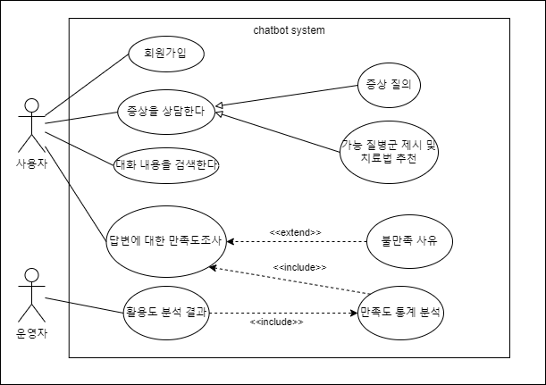
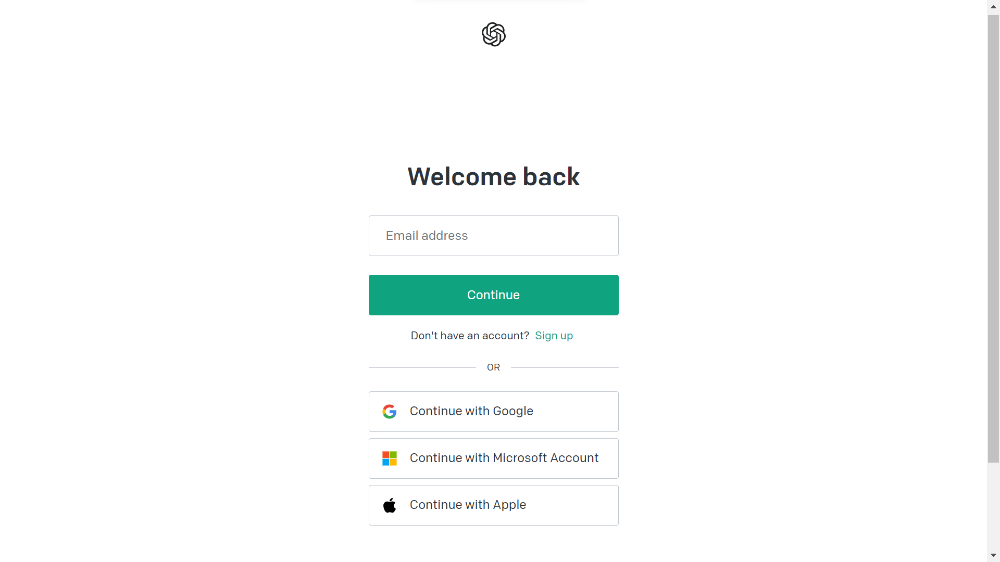
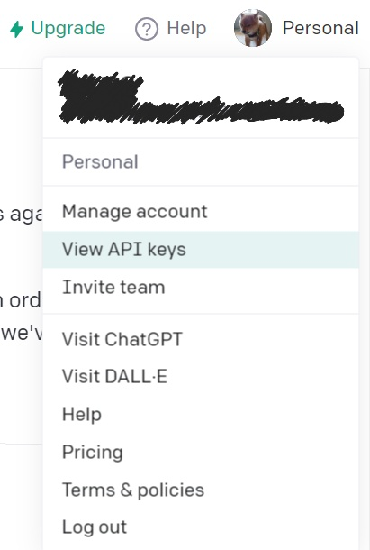
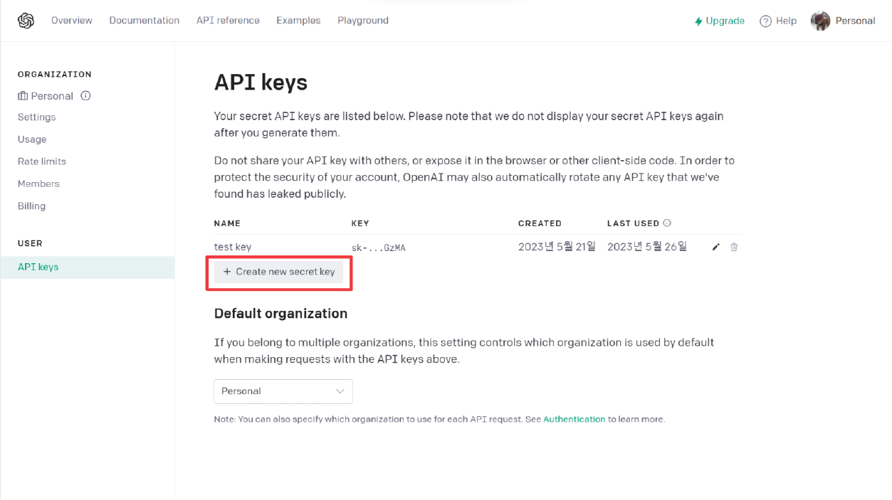
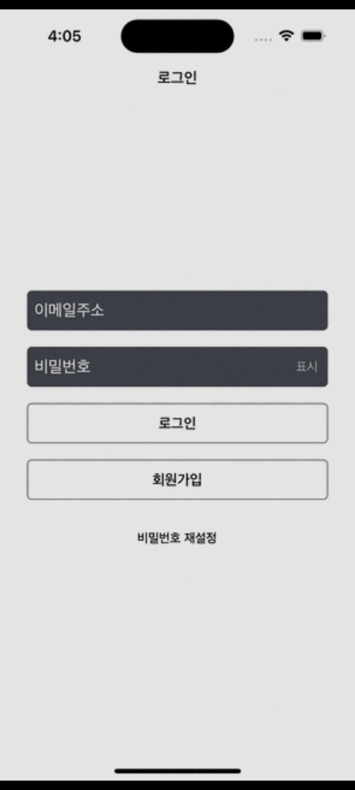
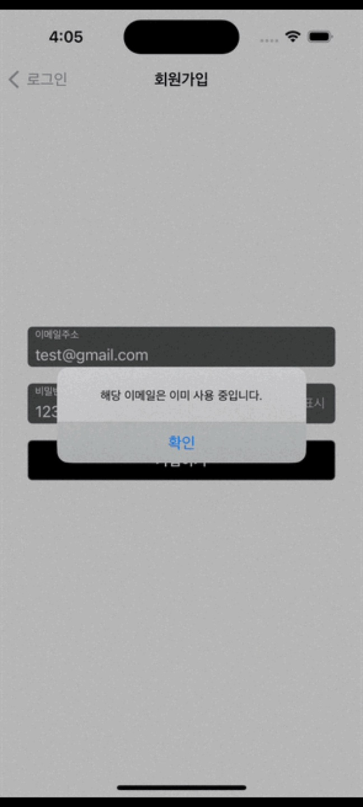
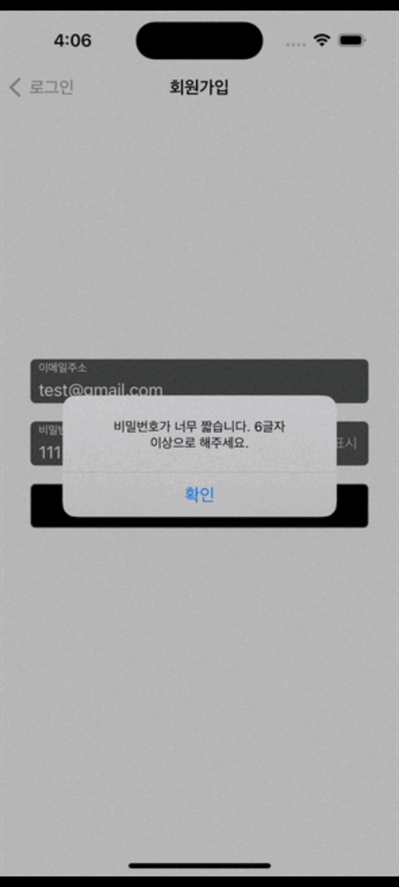
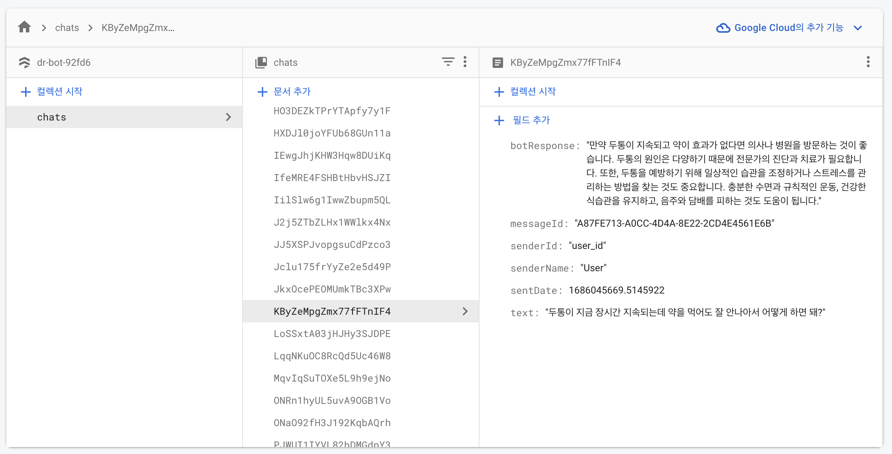

# Dr.Bot
## 소개
- 의학정보 제공 챗봇 제작 프로젝트

---

## 설명
### 목표
- OpenAI사의 오픈 API 를 경험해본다
- swift를 사용하여 챗봇을 구현해본다


### User Scenario
| 구성요소 | 설명 |
| :----------: | :---------- |
| 사용자 그룹 | 의료서비스 관련 전문적인 답변이 필요한 스마트폰 이용자 |
| 시놉시스  | <li> A씨는 원인 모를 복통으로 불편함을 호소하고 있으며 병원에 갈만큼 아프지만 현재 업무량이 많아 당장 병원을 갈 수 없는 상황이다. 따라서 간단하게라도 진단을 받고자하며 증상이 완화되기를 원한다.</li><li> B씨는 장시간 두통으로 인해 약국 약을 복용하였으나 증상이 완화되지 않았다. 병원에 방문할 만큼 아픈 것은 아니지만 증상이 잘 낫지 않기 때문에 원인과 도움이 되는 해결법을 제공받고자 한다.</li> |
|  니즈   | 병원에가지 않고 통증의 원인이 될 수 있는 요인들을 제공받고 증상 완화와 치유 촉진에 도움이 되는 방법들을 제안 받고자 한다. |
| 불편사항 | 인터넷에서는 환자에게 주어진 상황에 맞는 통증 원인을 정확히 알아낼 수 없으며해당 정보의 정확성을 알 수 없기 때문에 신뢰성이 떨어진다떨어진다. 하지만 의료 챗봇을 이용한다면                  사용자가 언급한 증상들을 기반으로 알맞는 정보를 제공할 수 있다. |
| 대안마련 | 사용자가알고자 하는 증상의 원인을 간단한 채팅채팅(키워드키워드)로 파악할 수 있으며 높은신뢰성을 제공하며 시간이 없는 사람들은 병원에 가지 않고도 어느정도 자신의 문제를파악하여               증상을 완화시킬 수 있다. |


### Usecase Diagram



### 주요기능
- 회원가입, 로그인
- 채팅
- 대화내용 기록
- 만족도 조사 (구현 예정)

---

## 설치 및 사용법
1. openai api key 발급 받기
- https://platform.openai.com/account/api-keys 페이지로 접속후 로그인


- 우측 상단의 "Personal" 메뉴에서 "View API keys" 클릭


- Create new secret key 클릭


- Secret key 이름을 작성한 후 create 버튼 클릭

발급 받은 api key는 절대로 다른 사람과 공유하면 안되며 API 키가 실수로 프로그램 코드를 통해서 노출되지 않도록 각별히 주의가 필요합니다.  
  
# 
- test/View/ChatViewController.swift 코드에 api key를 입력한다.

```
    private var messages: [MessageType] = []
    private let apiKey = "<Your API key>"
    private let botSender = Sender(senderId: "bot_id", displayName: "Bot")
    private let openAI = OpenAISwift(authToken: "<Your API key>")
```
  
--- 

## 프로젝트 시연
0. 실행시 첫 화면


1. 회원가입

| <ul><li>회원가입 페이지</li></ul> |  |
| -------------------------------- | ------------------------------------------------------------------- |

| <ul><li>이미 사용중인 이메일로는 가입 불가</li></ul> |  |
| ------------------------------------------------- | --------------------------------------------------------------------------- |
| <ul><li>비밀번호가 너무 짧을 시 가입 불가</li></ul> |  |


2. 로그인

| <ul><li>로그인 페이지</li></ul> |  |
| ------------------------------ | ------------------------------------------------------------------- |


3. 채팅

| <ul><li>채팅 구현</li></ul> |  |
| -------------------------- | ---------------------------------------------------------------- |
|  |  |


---

## 기여 방법
1. 코드 리뷰 및 테스트
  - 단위테스트 시나리오: https://docs.google.com/spreadsheets/d/1gdXJVQHtY6bSitcdp7CNkWtmWjTixxSsHud08weKp0U/edit?usp=sharing
  - 통합테스트 시나리오: https://docs.google.com/spreadsheets/d/1h8-iBOBPA82oOtzE7rmhJlfeZxQwXmajl4oLujVt6CQ/edit?usp=sharing

2. 보안 테스트 및 개선  

3. 버그 리포트  
Issues 메뉴 혹은 이메일을 통해 에러 사항을 공유해주세요

    Issues: https://github.com/castelwoah/OSS/issues/new?assignees=&labels=&projects=&template=custom.md&title=  
    email: <32197256psw@dankook.ac.kr> or <heyjudelee98@gmail.com>


---

## 라이센스
This project is licensed under the terms of the MIT license.

---

## 참고
### [OpenAI API reference](https://platform.openai.com/docs/api-reference)
### [OpenAISwift](https://github.com/adamrushy/OpenAISwift)

